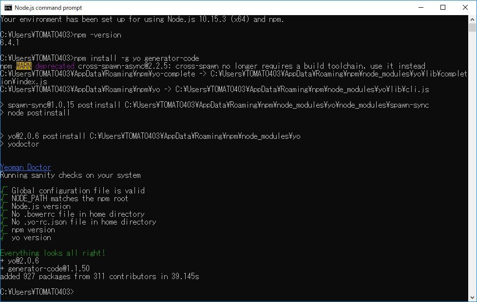
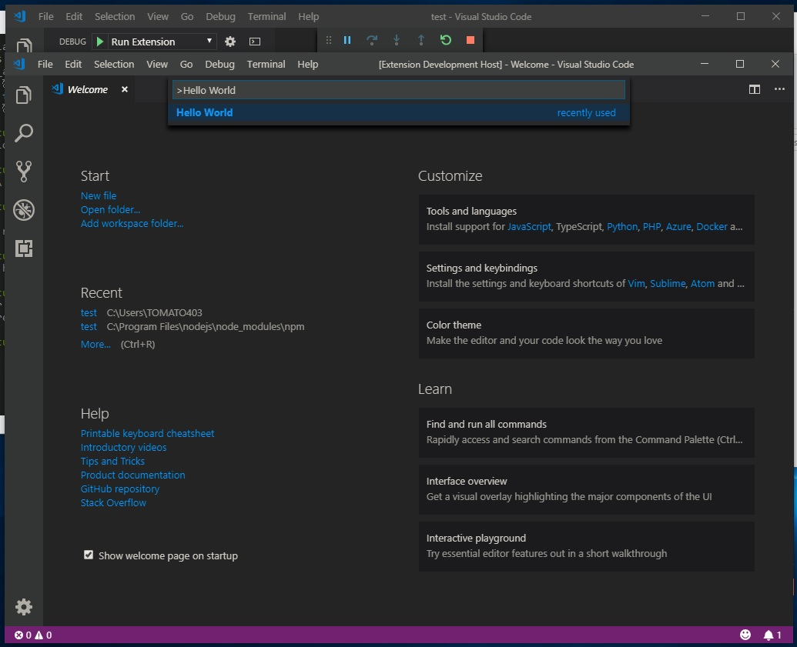
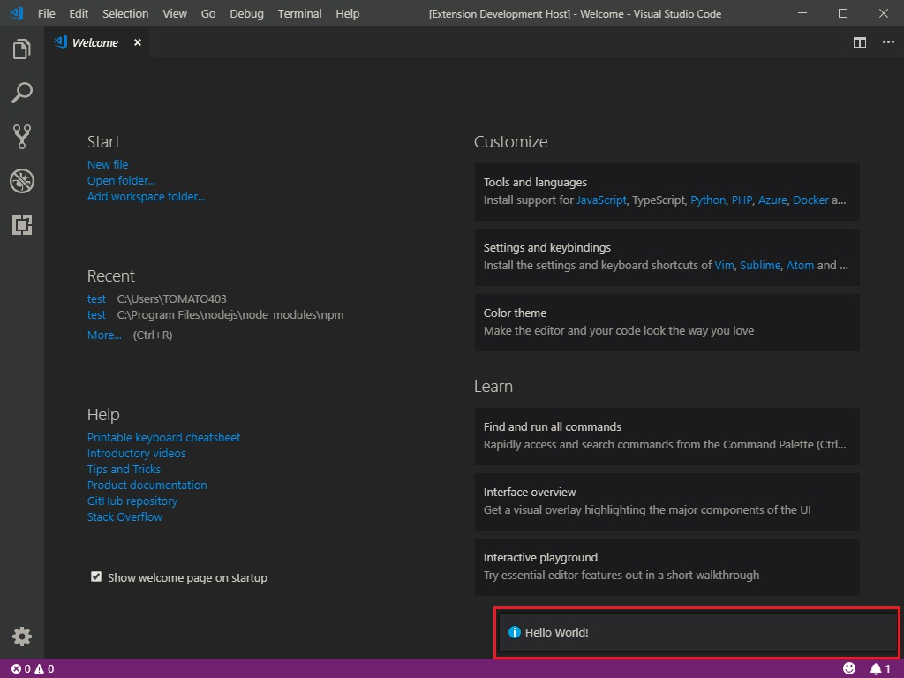

# Visual Studio Code 拡張機能の作り方

## ～ざっくりとした作成から実行までの流れ～
1. Node.jsをインストール
2. npmにてYeomenとジェネレーターをインストール
3. Yeomenで拡張機能プロジェクトを作成
4. 3で作成したプロジェクトディレクトリをVSCodeで開きデバッグ。 
新規ウィンドウが出るのでコマンドパレットに`Hello World`と入力し実行すると、画面右下にトーストのようなものが出てくる。

## ～準備編～
実行環境:Windows10 Home 64bit

1. Node.jsをインストール(ここではLTS版を選択)
    - インストールする際のオプションは特に変更しなくて良い
2. Node.jsのインストールが終わったら**Node.js Command Prompt**を開き以下コマンドを実行
    `nmp -v`(バージョンを確認し、正しくインストールできているかを確認)

3. YeomenとVSCode用のGeneratorをインストール
    - Node.jsターミナルにて`nmp install -g yo generator-code`と入力

2と3の実行画面

4. 3のインストールが終わったら`yo code`と入力
    - レポートについて聞かれるが好きなほうを選択
    - 作りたいプロジェクトについて聞かれるので、New Extension(TypeScript)を選択
    - extension name,extension ID,extensionの説明を適宜入力
    - Gitに関してはお好みでどうぞ

5. 4の作業が完了すると、ユーザーフォルダ直下に**extension name**で入力した名前のフォルダが作成されているので、VSCodeでこのディレクトリを開く
6. F5を押しデバッグすると、新しくウィンドウが作られるので**Ctrl+Shift+P**を押し`Hello World`と入力すると画面右下にトーストが出てくる。

VSCodeにてHello Worldの実行画面

## 自作する
実際に動作するプログラムは拡張機能プロジェクトディレクトリの**src/extension.ts**を編集すれば良い 
また、作成した拡張機能を使うには、 **ユーザーフォルダ/.vscode/extensions** に[先ほど](#PJ)で作成したディレクトリ毎コピーすればよい